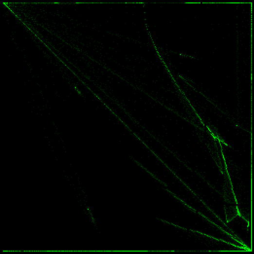
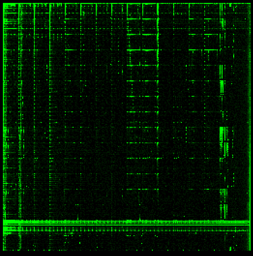

# Cantordust-Ghidra 

 



CantorDust is a binary visulization tool used to aid reverse engineering efforts. It allows humans to utilize their superior visual pattern recognition to identify patterns in binary data.

CantorDust (then ..cantor.dust..) was originally created by Chris Domas (xoreaxeaxeax), with funding from Battelle. The Ghidra plugin version of CantorDust was primarily developed by Battelle interns AJ Snedden and Mike Senglemann with funding from Battelle. 

Take a look at [this blogpost](https://inside.battelle.org/blog-details/battelle-publishes-open-source-binary-visualization-tool) to learn more about the algorithms and history behind this tool.

**Cantordust is dependent on Ghidra version 9.1 or higher**

## Installation and Setup:

1. Clone the repository from Github

2. Install Ghidra **9.1** or higher (Cantordust requires this version or higher)
      1. Download from: [https://ghidra-sre.org](https://ghidra-sre.org/)
      2. Refer to the Ghidra Installation Guide: https://ghidra-sre.org/InstallationGuide.html
3. Open Ghidra and start a new Project
4. Map the Script Manager to your cantordust repo
   1. Click the green play button in the task bar (script manager)
   2. Click on the icon called "script directories" when hovered over
   3. Click the green `+` (plus sign) and add the cantordust directory to the list
5. Run Cantordust for testing
   1. Filter the script manager for `Cantordust.java`. 
   2. Highlight the file and click the green play button

> You can also assign a key binding to Cantordust.java by right clicking on the plugin.

## Updating Cantordust:

1. Navigate to your `cantordust/` directory that stores this repository.
2. run: `git pull`
3. run: `python cleanup.py`
   - If this doesn't work, refer to *"Development Tips:"*, section *"Ghidra Script Compilation"* for details on setup of your cleanup script.
4. Open up Ghidra and launch Cantordust as normal.
   - If you're having trouble, refer to *"Installation and Setup: Steps 4-5"* 

## Development Tips:

Feel free to make modifications, changes and updates to this repository. Below are some tips on how to get started.

#### Ghidra Script API

The Ghidra API is your friend. When in ghidra go to: "Help", and select "Ghidra API Help". This will take you to an interactive html page which provides everything you need to know in order to interact with the API.

In order for Ghidra Scripts to work, the file that is run must extend GhidraScript like so:

```java
import ghidra.app.script.GhidraScript;
public class Cantordust extends GhidraScript { }
```

This class `Cantordust` is the only class that can interact with the API.

> When adding a new `.java` file to the repo, make sure you pass `cantordust` to it as a parameter in it's initialization. The only way you can print when testing a ghidra script, is by calling the class that extends GhidraScript and then calling your print statement. This will print in the Ghidra console. Example Below:

```java
cantordust.printf("");
```

#### Ghidra Script Compilation

Ghidra Scripts are <u>**not**</u> automatically recompiled at runtime. This means that in order for you to make sure your live changes actually get applied at runtime, you need to delete the related `.class` files that Ghidra generates at compilation. Ghidra stores these class files in a directory labeled `bin` that is unique to every user, making it difficult to automate. We currently do this with a python script, `cleanup.py`, which looks for a file within the same directory called `ghidra_bin_location.txt`. Our python script expects the `txt` file to contain a utf-8 encoding of your specific bin location where the `.class` files are generated. The python script then will delete every `.class` file within the directory.  `ghidra_bin_location.txt` must exist and contain the ghidra bin folder location for it to work properly. 

> **Update:** We have made advancements in automating this process, where `Cantordust.java` will actually locate the `bin` directory for you and write the location in a `ghidra_bin_location.txt` file for you at runtime. If this doesn't work on your operating system for whatever reason, the cleanup script will not work and you will have to create the `ghidra_bin_location.txt` file yourself.

Here is an example file location on a linux system:

```txt
/home/user/.ghidra/.ghidra_9.1_PUBLIC/dev/ghidra_scripts/bin/
```

> If you run into issues when running the script, this is probably because of the `UTF` encoding in your txt file. It should be `UTF-8`, but if you're having trouble figuring out how to force this you can edit the python script to decode `UTF-16` instead.
